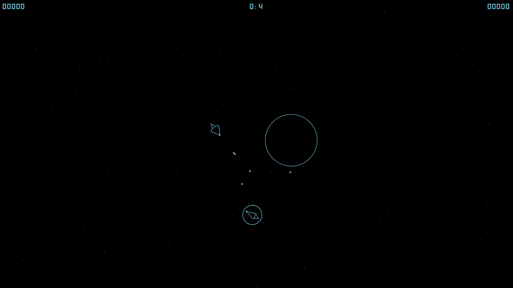

# SPACEWAR 2024
Inspired by the video game developed by Steve Russell in 1962 (see [wiki](https://en.wikipedia.org/wiki/Spacewar!))

Fight against an artificial intelligence spaceship. Maneuver in zero gravity next to a neutron star's gravity well. The game world simulation is based on Newtonian physics. The AI ship is equipped with more powerful weapons and can also perform hyper-stop near a neutron star. If you choose the right speed for your spaceship, you can go into orbit around a neutron star

## Download binaries
- For Linux x64 distributions [download](https://github.com/vblila/go-spacewar/raw/master/bin/linux64/spacewar)
- For Windows x32 distributions [download](https://github.com/vblila/go-spacewar/raw/master/bin/win32/spacewar.exe)
- For Windows x64 distributions [download](https://github.com/vblila/go-spacewar/raw/master/bin/win64/spacewar.exe)

To run the game, the OpenGL library must be installed on your computer. See [official documentation](https://www.khronos.org/opengl/wiki/Getting_Started#Downloading_OpenGL) how to download and install OpenGL libraries depending on your platform.

The simplest way to install OpenGL:
- On Ubuntu: install `libgl1-mesa-dev` and `xorg-dev` packages
- On Windows: download Mesa3D (only software rendering) for [x32](https://github.com/vblila/go-spacewar/raw/master/bin/win32/opengl32.dll.zip) or [x64](https://github.com/vblila/go-spacewar/raw/master/bin/win64/opengl32.dll.zip) platforms and extract `opengl32.dll` in the same directory as the `spacewar.exe` 

## For developers
You need to install additional libraries depending on your platform (see [go-gl readme](https://github.com/go-gl/glfw/blob/master/README.md))

## Gameplay screenshots

## Copyright
Copyright (c) 2024 Vladimir Lila. See LICENSE for details.